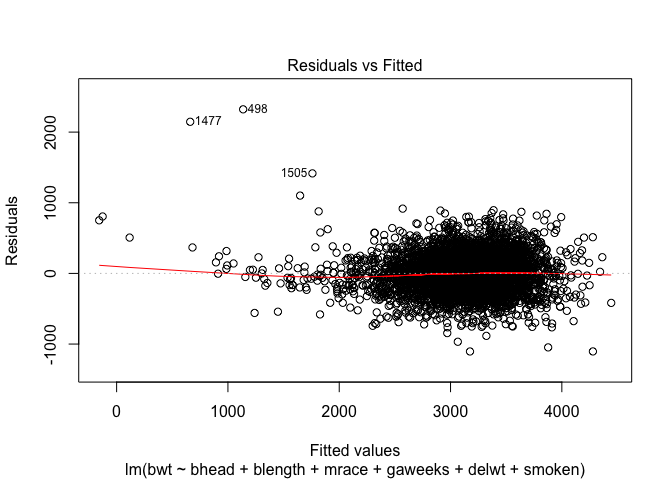

p8105\_hw6\_xz2788
================
Xiaoyue Zhang
11/17/2018

First load necessary packages

``` r
library(tidyverse)
```

    ## ── Attaching packages ───────────────────────────────────────────────── tidyverse 1.2.1 ──

    ## ✔ ggplot2 3.0.0     ✔ purrr   0.2.5
    ## ✔ tibble  1.4.2     ✔ dplyr   0.7.6
    ## ✔ tidyr   0.8.1     ✔ stringr 1.3.1
    ## ✔ readr   1.1.1     ✔ forcats 0.3.0

    ## ── Conflicts ──────────────────────────────────────────────────── tidyverse_conflicts() ──
    ## ✖ dplyr::filter() masks stats::filter()
    ## ✖ dplyr::lag()    masks stats::lag()

``` r
library(leaps)
library(modelr)
```

Problem 1
---------

Read in the raw data of homicides and parse columns

``` r
homicide = read_csv(file = "./data/homicide-data.csv",
                    col_types = "cccccdcccddc")
```

### Tidy data

Create a city\_state variable and a binary variable indicating whether the homicide is solved and tidy the dataset as required

``` r
homicide_tidy = homicide %>% 
  mutate(city_state = str_c(city, ",", state)) %>% 
  mutate(result = ifelse(disposition == "Closed by arrest", "solved", "unsolved")) %>% 
  filter(city_state != "Dallas,TX" & city_state != "Phoenix,AZ" & city_state != "Kansas City,MO" & city_state != "Tulsa,AL") %>% 
  mutate(victim_race = ifelse(victim_race == "White", "white", "non-white")) %>% 
  mutate(victim_race = as_factor(victim_race))

#relevel "race" factor, "white" as reference
homicide_tidy$victim_race = relevel(homicide_tidy$victim_race, ref = "white")
```

### Analysis in Baltimore

Fit a logistic regression model for Baltimore

``` r
#"unsolved" as reference group
homicide_tidy$result = relevel(as_factor(homicide_tidy$result), ref = "unsolved")
logi_balti = homicide_tidy %>% 
  filter(city_state == "Baltimore,MD") %>% 
  glm(result ~ victim_age + victim_sex + victim_race, data = ., family = "binomial") 
logi_balti %>%  broom::tidy()
```

    ## # A tibble: 4 x 5
    ##   term                 estimate std.error statistic  p.value
    ##   <chr>                   <dbl>     <dbl>     <dbl>    <dbl>
    ## 1 (Intercept)           1.19      0.235        5.06 4.30e- 7
    ## 2 victim_age           -0.00699   0.00326     -2.14 3.22e- 2
    ## 3 victim_sexMale       -0.888     0.136       -6.53 6.80e-11
    ## 4 victim_racenon-white -0.820     0.175       -4.69 2.68e- 6

Obtain the estimate and CI of OR

``` r
conf_inter = logi_balti %>% 
  broom::confint_tidy() %>% 
  mutate(conf.low = exp(conf.low), conf.high = exp(conf.high))
logi_balti %>% 
  broom::tidy() %>% 
  mutate(OR = exp(estimate)) %>% 
  select(term, OR, log_OR = estimate, p.value) %>% 
  cbind(., conf_inter) %>% 
  knitr::kable(digits = 3)
```

| term                  |     OR|  log\_OR|  p.value|  conf.low|  conf.high|
|:----------------------|------:|--------:|--------:|---------:|----------:|
| (Intercept)           |  3.274|    1.186|    0.000|     2.076|      5.212|
| victim\_age           |  0.993|   -0.007|    0.032|     0.987|      0.999|
| victim\_sexMale       |  0.412|   -0.888|    0.000|     0.315|      0.537|
| victim\_racenon-white |  0.441|   -0.820|    0.000|     0.312|      0.620|

From the results, we can see that in Baltimore, for non-white victims, the odds of solving homicides and unsolved ones is 0.44 times the odds of that of white victims with adjusting for age and sex, which also means that homicides of white victims were more likely to be solved.

### Build logistic regression for each of the city

First creat a function to extract OR and 95%CI

``` r
odds_confi = function(x){
  
  ci = broom::confint_tidy(x) %>% 
    mutate(conf.low = exp(conf.low), conf.high = exp(conf.high))
  or_ci = x %>% 
    broom::tidy() %>% 
    mutate(OR = exp(estimate)) %>% 
  select(term, OR, log_OR = estimate) %>% 
  cbind(., ci)
  
  return(or_ci)
  
}
```

Conduct glm in each city and delete "Unknown" victim sex for later modeling

``` r
each_city = homicide_tidy %>% 
  filter(victim_sex != "Unknown") %>% 
  group_by(city_state) %>% 
  nest() %>% 
  mutate(model = map(data, ~glm(result ~ victim_age + victim_sex + victim_race, data = .x, family = "binomial"))) %>% 
  mutate(model = map(model, odds_confi)) %>% 
  select(-data) %>% 
  unnest()
head(each_city)
```

    ## # A tibble: 6 x 6
    ##   city_state     term                    OR  log_OR conf.low conf.high
    ##   <chr>          <chr>                <dbl>   <dbl>    <dbl>     <dbl>
    ## 1 Albuquerque,NM (Intercept)          3.62   1.29      1.72      7.94 
    ## 2 Albuquerque,NM victim_age           0.976 -0.0244    0.962     0.989
    ## 3 Albuquerque,NM victim_sexMale       1.58   0.455     0.890     2.78 
    ## 4 Albuquerque,NM victim_racenon-white 0.738 -0.304     0.447     1.21 
    ## 5 Atlanta,GA     (Intercept)          3.17   1.15      1.57      6.52 
    ## 6 Atlanta,GA     victim_age           0.988 -0.0118    0.979     0.997

Make a plot to show ORs and CIs for each city

``` r
each_city %>% 
  filter(term == "victim_racenon-white") %>% 
  transform(city_state = reorder(city_state, OR)) %>% 
  ggplot(aes(x = city_state, y = OR)) +
  geom_point() +
  geom_errorbar(aes(ymin = conf.low, ymax = conf.high)) +
  theme_bw() +
  theme(axis.text.x = element_text(angle = 90, hjust = 1)) +
  labs(
    title = "Estimated odds ratio and 95% CI of race",
    x = "City",
    y = "Estimated odds ratio of race",
    caption = "Data from the Washington Post"
  ) +
  theme(legend.position = "bottom")
```


Comment: Across the cities, Boston has the lowest estimated odds ratio for solving homicides comparing non-white victims to white victims and Tampa, FL has the highes estimated odds ratio. Only Durham and Tampa have estimated odds ratio over 1 which means in these cities, homicides of non-white victims are more likely to be solved while all other cities were the opposite, but the confidence interval included 1 which meas actually no difference between the odds ration in non-white and white victims.

Problem 2
---------

Read in the data first

``` r
birthweight = read_csv(file = "./data/birthweight.csv.csv")
```

    ## Parsed with column specification:
    ## cols(
    ##   .default = col_integer(),
    ##   gaweeks = col_double(),
    ##   ppbmi = col_double(),
    ##   smoken = col_double()
    ## )

    ## See spec(...) for full column specifications.

Look at the data first and check NAs

``` r
str(birthweight)
```

    ## Classes 'tbl_df', 'tbl' and 'data.frame':    4342 obs. of  20 variables:
    ##  $ babysex : int  2 1 2 1 2 1 2 2 1 1 ...
    ##  $ bhead   : int  34 34 36 34 34 33 33 33 36 33 ...
    ##  $ blength : int  51 48 50 52 52 52 46 49 52 50 ...
    ##  $ bwt     : int  3629 3062 3345 3062 3374 3374 2523 2778 3515 3459 ...
    ##  $ delwt   : int  177 156 148 157 156 129 126 140 146 169 ...
    ##  $ fincome : int  35 65 85 55 5 55 96 5 85 75 ...
    ##  $ frace   : int  1 2 1 1 1 1 2 1 1 2 ...
    ##  $ gaweeks : num  39.9 25.9 39.9 40 41.6 ...
    ##  $ malform : int  0 0 0 0 0 0 0 0 0 0 ...
    ##  $ menarche: int  13 14 12 14 13 12 14 12 11 12 ...
    ##  $ mheight : int  63 65 64 64 66 66 72 62 61 64 ...
    ##  $ momage  : int  36 25 29 18 20 23 29 19 13 19 ...
    ##  $ mrace   : int  1 2 1 1 1 1 2 1 1 2 ...
    ##  $ parity  : int  3 0 0 0 0 0 0 0 0 0 ...
    ##  $ pnumlbw : int  0 0 0 0 0 0 0 0 0 0 ...
    ##  $ pnumsga : int  0 0 0 0 0 0 0 0 0 0 ...
    ##  $ ppbmi   : num  26.3 21.3 23.6 21.8 21 ...
    ##  $ ppwt    : int  148 128 137 127 130 115 105 119 105 145 ...
    ##  $ smoken  : num  0 0 1 10 1 0 0 0 0 4 ...
    ##  $ wtgain  : int  29 28 11 30 26 14 21 21 41 24 ...
    ##  - attr(*, "spec")=List of 2
    ##   ..$ cols   :List of 20
    ##   .. ..$ babysex : list()
    ##   .. .. ..- attr(*, "class")= chr  "collector_integer" "collector"
    ##   .. ..$ bhead   : list()
    ##   .. .. ..- attr(*, "class")= chr  "collector_integer" "collector"
    ##   .. ..$ blength : list()
    ##   .. .. ..- attr(*, "class")= chr  "collector_integer" "collector"
    ##   .. ..$ bwt     : list()
    ##   .. .. ..- attr(*, "class")= chr  "collector_integer" "collector"
    ##   .. ..$ delwt   : list()
    ##   .. .. ..- attr(*, "class")= chr  "collector_integer" "collector"
    ##   .. ..$ fincome : list()
    ##   .. .. ..- attr(*, "class")= chr  "collector_integer" "collector"
    ##   .. ..$ frace   : list()
    ##   .. .. ..- attr(*, "class")= chr  "collector_integer" "collector"
    ##   .. ..$ gaweeks : list()
    ##   .. .. ..- attr(*, "class")= chr  "collector_double" "collector"
    ##   .. ..$ malform : list()
    ##   .. .. ..- attr(*, "class")= chr  "collector_integer" "collector"
    ##   .. ..$ menarche: list()
    ##   .. .. ..- attr(*, "class")= chr  "collector_integer" "collector"
    ##   .. ..$ mheight : list()
    ##   .. .. ..- attr(*, "class")= chr  "collector_integer" "collector"
    ##   .. ..$ momage  : list()
    ##   .. .. ..- attr(*, "class")= chr  "collector_integer" "collector"
    ##   .. ..$ mrace   : list()
    ##   .. .. ..- attr(*, "class")= chr  "collector_integer" "collector"
    ##   .. ..$ parity  : list()
    ##   .. .. ..- attr(*, "class")= chr  "collector_integer" "collector"
    ##   .. ..$ pnumlbw : list()
    ##   .. .. ..- attr(*, "class")= chr  "collector_integer" "collector"
    ##   .. ..$ pnumsga : list()
    ##   .. .. ..- attr(*, "class")= chr  "collector_integer" "collector"
    ##   .. ..$ ppbmi   : list()
    ##   .. .. ..- attr(*, "class")= chr  "collector_double" "collector"
    ##   .. ..$ ppwt    : list()
    ##   .. .. ..- attr(*, "class")= chr  "collector_integer" "collector"
    ##   .. ..$ smoken  : list()
    ##   .. .. ..- attr(*, "class")= chr  "collector_double" "collector"
    ##   .. ..$ wtgain  : list()
    ##   .. .. ..- attr(*, "class")= chr  "collector_integer" "collector"
    ##   ..$ default: list()
    ##   .. ..- attr(*, "class")= chr  "collector_guess" "collector"
    ##   ..- attr(*, "class")= chr "col_spec"

``` r
skimr::skim(birthweight)
```

    ## Skim summary statistics
    ##  n obs: 4342 
    ##  n variables: 20 
    ## 
    ## ── Variable type:integer ─────────────────────────────────────────────────────────────────
    ##  variable missing complete    n      mean      sd  p0  p25    p50  p75
    ##   babysex       0     4342 4342    1.49     0.5     1    1    1      2
    ##     bhead       0     4342 4342   33.65     1.62   21   33   34     35
    ##   blength       0     4342 4342   49.75     2.72   20   48   50     51
    ##       bwt       0     4342 4342 3114.4    512.15  595 2807 3132.5 3459
    ##     delwt       0     4342 4342  145.57    22.21   86  131  143    157
    ##   fincome       0     4342 4342   44.11    25.98    0   25   35     65
    ##     frace       0     4342 4342    1.66     0.85    1    1    2      2
    ##   malform       0     4342 4342    0.0035   0.059   0    0    0      0
    ##  menarche       0     4342 4342   12.51     1.48    0   12   12     13
    ##   mheight       0     4342 4342   63.49     2.66   48   62   63     65
    ##    momage       0     4342 4342   20.3      3.88   12   18   20     22
    ##     mrace       0     4342 4342    1.63     0.77    1    1    2      2
    ##    parity       0     4342 4342    0.0023   0.1     0    0    0      0
    ##   pnumlbw       0     4342 4342    0        0       0    0    0      0
    ##   pnumsga       0     4342 4342    0        0       0    0    0      0
    ##      ppwt       0     4342 4342  123.49    20.16   70  110  120    134
    ##    wtgain       0     4342 4342   22.08    10.94  -46   15   22     28
    ##  p100     hist
    ##     2 ▇▁▁▁▁▁▁▇
    ##    41 ▁▁▁▁▅▇▁▁
    ##    63 ▁▁▁▁▁▇▁▁
    ##  4791 ▁▁▁▃▇▇▂▁
    ##   334 ▁▇▅▁▁▁▁▁
    ##    96 ▁▂▇▂▂▂▁▃
    ##     8 ▇▇▁▁▁▁▁▁
    ##     1 ▇▁▁▁▁▁▁▁
    ##    19 ▁▁▁▁▂▇▁▁
    ##    77 ▁▁▁▅▇▂▁▁
    ##    44 ▂▇▅▂▁▁▁▁
    ##     4 ▇▁▇▁▁▁▁▁
    ##     6 ▇▁▁▁▁▁▁▁
    ##     0 ▁▁▁▇▁▁▁▁
    ##     0 ▁▁▁▇▁▁▁▁
    ##   287 ▁▇▆▁▁▁▁▁
    ##    89 ▁▁▁▇▇▁▁▁
    ## 
    ## ── Variable type:numeric ─────────────────────────────────────────────────────────────────
    ##  variable missing complete    n  mean   sd    p0   p25   p50   p75 p100
    ##   gaweeks       0     4342 4342 39.43 3.15 17.7  38.3  39.9  41.1  51.3
    ##     ppbmi       0     4342 4342 21.57 3.18 13.07 19.53 21.03 22.91 46.1
    ##    smoken       0     4342 4342  4.15 7.41  0     0     0     5    60  
    ##      hist
    ##  ▁▁▁▁▃▇▁▁
    ##  ▁▇▅▁▁▁▁▁
    ##  ▇▁▁▁▁▁▁▁

From the result, we can see that there is no missing value in all variables, but the classes of some variables should to be tidied.

### Tidy data

``` r
birthweight = birthweight %>% 
  mutate(babysex = as.factor(babysex),
         frace = as.factor(frace),
         malform = as.factor(malform),
         mrace = as.factor(mrace))
```

### Modeling process

-   First check whether the birthweight is normally distributed

``` r
birthweight %>% 
  ggplot(aes(x = bwt)) + 
  geom_histogram() +
  theme_bw() +
  labs(
    title = "Birthweight distribution",
    x = "Birthweight (grams)",
    y = "Count",
    caption = "Data from 'Birthweight' dataset")
```

    ## `stat_bin()` using `bins = 30`. Pick better value with `binwidth`.


From the plot, birthweight seems to be normally distributed with a little bit skewness to the left tail.

-   Select variables into the model by stepwise method with 'leap' function

``` r
regsubsets(bwt~., data = birthweight, nvmax = 5, method = "seqrep") %>% 
  summary()
```

    ## Warning in leaps.setup(x, y, wt = wt, nbest = nbest, nvmax = nvmax,
    ## force.in = force.in, : 3 linear dependencies found

    ## Reordering variables and trying again:

    ## Subset selection object
    ## Call: regsubsets.formula(bwt ~ ., data = birthweight, nvmax = 5, method = "seqrep")
    ## 24 Variables  (and intercept)
    ##          Forced in Forced out
    ## babysex2     FALSE      FALSE
    ## bhead        FALSE      FALSE
    ## blength      FALSE      FALSE
    ## delwt        FALSE      FALSE
    ## fincome      FALSE      FALSE
    ## frace2       FALSE      FALSE
    ## frace3       FALSE      FALSE
    ## frace4       FALSE      FALSE
    ## frace8       FALSE      FALSE
    ## gaweeks      FALSE      FALSE
    ## malform1     FALSE      FALSE
    ## menarche     FALSE      FALSE
    ## mheight      FALSE      FALSE
    ## momage       FALSE      FALSE
    ## mrace2       FALSE      FALSE
    ## mrace3       FALSE      FALSE
    ## mrace4       FALSE      FALSE
    ## parity       FALSE      FALSE
    ## ppbmi        FALSE      FALSE
    ## ppwt         FALSE      FALSE
    ## smoken       FALSE      FALSE
    ## pnumlbw      FALSE      FALSE
    ## pnumsga      FALSE      FALSE
    ## wtgain       FALSE      FALSE
    ## 1 subsets of each size up to 6
    ## Selection Algorithm: 'sequential replacement'
    ##          babysex2 bhead blength delwt fincome frace2 frace3 frace4 frace8
    ## 1  ( 1 ) " "      "*"   " "     " "   " "     " "    " "    " "    " "   
    ## 2  ( 1 ) " "      "*"   "*"     " "   " "     " "    " "    " "    " "   
    ## 3  ( 1 ) " "      "*"   "*"     " "   " "     " "    " "    " "    " "   
    ## 4  ( 1 ) " "      "*"   "*"     "*"   " "     " "    " "    " "    " "   
    ## 5  ( 1 ) " "      "*"   "*"     "*"   " "     " "    " "    " "    " "   
    ## 6  ( 1 ) " "      "*"   "*"     "*"   " "     " "    " "    " "    " "   
    ##          gaweeks malform1 menarche mheight momage mrace2 mrace3 mrace4
    ## 1  ( 1 ) " "     " "      " "      " "     " "    " "    " "    " "   
    ## 2  ( 1 ) " "     " "      " "      " "     " "    " "    " "    " "   
    ## 3  ( 1 ) " "     " "      " "      " "     " "    "*"    " "    " "   
    ## 4  ( 1 ) " "     " "      " "      " "     " "    "*"    " "    " "   
    ## 5  ( 1 ) "*"     " "      " "      " "     " "    "*"    " "    " "   
    ## 6  ( 1 ) "*"     " "      " "      " "     " "    "*"    " "    " "   
    ##          parity pnumlbw pnumsga ppbmi ppwt smoken wtgain
    ## 1  ( 1 ) " "    " "     " "     " "   " "  " "    " "   
    ## 2  ( 1 ) " "    " "     " "     " "   " "  " "    " "   
    ## 3  ( 1 ) " "    " "     " "     " "   " "  " "    " "   
    ## 4  ( 1 ) " "    " "     " "     " "   " "  " "    " "   
    ## 5  ( 1 ) " "    " "     " "     " "   " "  " "    " "   
    ## 6  ( 1 ) " "    " "     " "     " "   " "  "*"    " "

From the result, we can see that "bhead", "blength", "mrace", "delwt", "gaweeks", "smoken" can be selected into the model, but from knowledge of medicine, "malform", "wtgain", "pnumlbw" and "pnumsga" can also be related to the birthweight of the baby, but because all the data for "pnumsga" and "pnumlbw" is 0, thus they can be removed from the model

-   Decide whether add "malform" and "wtgain" into the model

``` r
lm(bwt~bhead + blength + mrace + delwt + gaweeks + smoken, data = birthweight) %>% 
  summary()
```

    ## 
    ## Call:
    ## lm(formula = bwt ~ bhead + blength + mrace + delwt + gaweeks + 
    ##     smoken, data = birthweight)
    ## 
    ## Residuals:
    ##      Min       1Q   Median       3Q      Max 
    ## -1104.88  -180.75    -3.55   172.57  2322.39 
    ## 
    ## Coefficients:
    ##               Estimate Std. Error t value Pr(>|t|)    
    ## (Intercept) -5752.2622    97.2921 -59.124  < 2e-16 ***
    ## bhead         130.0230     3.4247  37.967  < 2e-16 ***
    ## blength        75.6670     2.0242  37.382  < 2e-16 ***
    ## mrace2       -147.3690     9.2591 -15.916  < 2e-16 ***
    ## mrace3        -74.8522    42.5481  -1.759   0.0786 .  
    ## mrace4       -117.7264    18.7867  -6.266 4.05e-10 ***
    ## delwt           2.2828     0.1964  11.623  < 2e-16 ***
    ## gaweeks        12.3447     1.4571   8.472  < 2e-16 ***
    ## smoken         -4.8472     0.5886  -8.235 2.35e-16 ***
    ## ---
    ## Signif. codes:  0 '***' 0.001 '**' 0.01 '*' 0.05 '.' 0.1 ' ' 1
    ## 
    ## Residual standard error: 274.3 on 4333 degrees of freedom
    ## Multiple R-squared:  0.7137, Adjusted R-squared:  0.7131 
    ## F-statistic:  1350 on 8 and 4333 DF,  p-value: < 2.2e-16

``` r
lm(bwt~bhead + blength + mrace + delwt + gaweeks + smoken +
     malform + wtgain, data = birthweight) %>% 
  summary()
```

    ## 
    ## Call:
    ## lm(formula = bwt ~ bhead + blength + mrace + delwt + gaweeks + 
    ##     smoken + malform + wtgain, data = birthweight)
    ## 
    ## Residuals:
    ##      Min       1Q   Median       3Q      Max 
    ## -1095.38  -183.31    -4.36   175.13  2333.48 
    ## 
    ## Coefficients:
    ##               Estimate Std. Error t value Pr(>|t|)    
    ## (Intercept) -5664.4011    98.2088 -57.677  < 2e-16 ***
    ## bhead         129.3121     3.4154  37.861  < 2e-16 ***
    ## blength        75.1460     2.0196  37.209  < 2e-16 ***
    ## mrace2       -148.6679     9.2322 -16.103  < 2e-16 ***
    ## mrace3        -83.3138    42.4299  -1.964   0.0496 *  
    ## mrace4       -119.6667    18.7284  -6.390 1.84e-10 ***
    ## delwt           1.8149     0.2126   8.538  < 2e-16 ***
    ## gaweeks        11.7975     1.4554   8.106 6.74e-16 ***
    ## smoken         -4.9148     0.5869  -8.374  < 2e-16 ***
    ## malform1        0.8394    70.8098   0.012   0.9905    
    ## wtgain          2.3871     0.4232   5.640 1.80e-08 ***
    ## ---
    ## Signif. codes:  0 '***' 0.001 '**' 0.01 '*' 0.05 '.' 0.1 ' ' 1
    ## 
    ## Residual standard error: 273.4 on 4331 degrees of freedom
    ## Multiple R-squared:  0.7158, Adjusted R-squared:  0.7151 
    ## F-statistic:  1091 on 10 and 4331 DF,  p-value: < 2.2e-16

"malform" seems not to have an effect on birthweigt since the p-value of it is greater than 0.05.

-   Compare models with/without "wtgain"

``` r
model_1 = lm(bwt~bhead + blength + mrace + gaweeks + smoken + delwt, data = birthweight)
model_2 = lm(bwt~bhead + blength + mrace + gaweeks + smoken + delwt + wtgain, data = birthweight)
anova(model_1, model_2)
```

    ## Analysis of Variance Table
    ## 
    ## Model 1: bwt ~ bhead + blength + mrace + gaweeks + smoken + delwt
    ## Model 2: bwt ~ bhead + blength + mrace + gaweeks + smoken + delwt + wtgain
    ##   Res.Df       RSS Df Sum of Sq      F    Pr(>F)    
    ## 1   4333 326041049                                  
    ## 2   4332 323661075  1   2379974 31.855 1.768e-08 ***
    ## ---
    ## Signif. codes:  0 '***' 0.001 '**' 0.01 '*' 0.05 '.' 0.1 ' ' 1

``` r
summary(model_1)
```

    ## 
    ## Call:
    ## lm(formula = bwt ~ bhead + blength + mrace + gaweeks + smoken + 
    ##     delwt, data = birthweight)
    ## 
    ## Residuals:
    ##      Min       1Q   Median       3Q      Max 
    ## -1104.88  -180.75    -3.55   172.57  2322.39 
    ## 
    ## Coefficients:
    ##               Estimate Std. Error t value Pr(>|t|)    
    ## (Intercept) -5752.2622    97.2921 -59.124  < 2e-16 ***
    ## bhead         130.0230     3.4247  37.967  < 2e-16 ***
    ## blength        75.6670     2.0242  37.382  < 2e-16 ***
    ## mrace2       -147.3690     9.2591 -15.916  < 2e-16 ***
    ## mrace3        -74.8522    42.5481  -1.759   0.0786 .  
    ## mrace4       -117.7264    18.7867  -6.266 4.05e-10 ***
    ## gaweeks        12.3447     1.4571   8.472  < 2e-16 ***
    ## smoken         -4.8472     0.5886  -8.235 2.35e-16 ***
    ## delwt           2.2828     0.1964  11.623  < 2e-16 ***
    ## ---
    ## Signif. codes:  0 '***' 0.001 '**' 0.01 '*' 0.05 '.' 0.1 ' ' 1
    ## 
    ## Residual standard error: 274.3 on 4333 degrees of freedom
    ## Multiple R-squared:  0.7137, Adjusted R-squared:  0.7131 
    ## F-statistic:  1350 on 8 and 4333 DF,  p-value: < 2.2e-16

``` r
summary(model_2)
```

    ## 
    ## Call:
    ## lm(formula = bwt ~ bhead + blength + mrace + gaweeks + smoken + 
    ##     delwt + wtgain, data = birthweight)
    ## 
    ## Residuals:
    ##      Min       1Q   Median       3Q      Max 
    ## -1095.38  -183.31    -4.37   175.12  2333.47 
    ## 
    ## Coefficients:
    ##               Estimate Std. Error t value Pr(>|t|)    
    ## (Intercept) -5664.3866    98.1899 -57.688  < 2e-16 ***
    ## bhead         129.3125     3.4149  37.868  < 2e-16 ***
    ## blength        75.1456     2.0191  37.217  < 2e-16 ***
    ## mrace2       -148.6702     9.2292 -16.109  < 2e-16 ***
    ## mrace3        -83.3172    42.4240  -1.964   0.0496 *  
    ## mrace4       -119.6706    18.7233  -6.392 1.82e-10 ***
    ## gaweeks        11.7973     1.4551   8.107 6.67e-16 ***
    ## smoken         -4.9146     0.5866  -8.378  < 2e-16 ***
    ## delwt           1.8149     0.2125   8.539  < 2e-16 ***
    ## wtgain          2.3873     0.4230   5.644 1.77e-08 ***
    ## ---
    ## Signif. codes:  0 '***' 0.001 '**' 0.01 '*' 0.05 '.' 0.1 ' ' 1
    ## 
    ## Residual standard error: 273.3 on 4332 degrees of freedom
    ## Multiple R-squared:  0.7158, Adjusted R-squared:  0.7152 
    ## F-statistic:  1212 on 9 and 4332 DF,  p-value: < 2.2e-16

Although adding "wtgain" can increase the adjusted R-square, but the magnitude is not big, thus I choose to not include "wtgain".

-   Double check the collinearity among selected variables

``` r
birthweight %>% 
  select(bwt, bhead, blength, delwt, gaweeks, smoken) %>% 
  cor()
```

    ##                 bwt       bhead     blength      delwt    gaweeks
    ## bwt      1.00000000  0.74710678  0.74345075 0.28788931 0.41218335
    ## bhead    0.74710678  1.00000000  0.63045480 0.21437072 0.37845649
    ## blength  0.74345075  0.63045480  1.00000000 0.22914944 0.35926367
    ## delwt    0.28788931  0.21437072  0.22914944 1.00000000 0.12427846
    ## gaweeks  0.41218335  0.37845649  0.35926367 0.12427846 1.00000000
    ## smoken  -0.07562781 -0.05394723 -0.06562883 0.04861273 0.03621168
    ##              smoken
    ## bwt     -0.07562781
    ## bhead   -0.05394723
    ## blength -0.06562883
    ## delwt    0.04861273
    ## gaweeks  0.03621168
    ## smoken   1.00000000

-   Final regression model:

``` r
birth_model = lm(bwt~bhead + blength + mrace + gaweeks + delwt + smoken, data = birthweight)
```

### Make a plot to show residuals against fitted values

``` r
birthweight %>% 
  modelr::add_predictions(birth_model) %>% 
  modelr::add_residuals(birth_model) %>% 
  ggplot(aes(x = pred, y = resid)) + 
  geom_point(alpha = .5) +
  theme_bw() +
  labs(
    title = "Residual VS. fitted values plot",
    x = "Predited birthweight (grams)",
    y = "Residuals",
    caption = "Data from 'Birthweight' dataset")
```


``` r
plot(birth_model, 1)
```



From the plot, we can see that when the birthweight is between a range of 2000 to 4000 grams which is also the standard birthweight of neonates, the final model can predicted the birthweight more accurately with less residuals. However, when birthweight is too small or too large, the residuals are too big to predict it accuarately.

### Compare with two other models

-   Build other two models

``` r
two_pred_model = lm(bwt ~ blength + gaweeks, data = birthweight)
intera_model = lm(bwt ~ (bhead + blength + babysex)^2 +
                    (bhead + blength + babysex)^3, data = birthweight)
```

-   Conduct cross validation

``` r
crossv_mc(birthweight, 100) %>% 
  mutate(train = map(train, as_tibble),
         test = map(test, as_tibble)) %>% 
  mutate(final_model = map(train, ~lm(bwt ~ bhead + blength + mrace + gaweeks + delwt + smoken, data = .x)),
         two_pred_model = map(train, ~lm(bwt ~ blength + gaweeks, data = .x)),
         intera_model = map(train, ~lm(bwt ~ (bhead + blength + babysex)^2 +
                    (bhead + blength + babysex)^3, data = .x))) %>% 
   mutate(rmse_final  = map2_dbl(final_model, test, ~rmse(model = .x, data = .y)),
         rmse_two_pre = map2_dbl(two_pred_model, test, ~rmse(model = .x, data = .y)),
         rmse_intera = map2_dbl(intera_model, test, ~rmse(model = .x, data = .y))) %>% 
  select(starts_with("rmse")) %>% 
  gather(key = model, value = rmse) %>% 
  mutate(model = str_replace(model, "rmse_", ""),
         model = fct_inorder(model)) %>% 
  ggplot(aes(x = model, y = rmse)) + 
  geom_violin() +
  theme_bw()
```


Comment:
